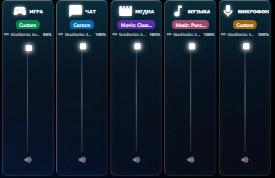

# Sonar Glass Widget

Desktop widget for controlling SteelSeries Sonar audio channels with a beautiful glassmorphism UI.



## Features

- Real-time volume control for all Sonar channels (Game, Chat, Media, Music, Mic)
- Glassmorphism transparent UI
- Auto-sync with SteelSeries GG
- Smart auto-hide when covered by other windows
- Auto-start with Windows
- Draggable widget position (saved between sessions)

## Requirements

- Windows 10/11
- SteelSeries GG with Sonar enabled
- Node.js 16+ (for development)

## Installation

### From Release
1. Download the latest release from [Releases](../../releases)
2. Run the installer or portable version
3. Widget will auto-start with Windows

### From Source
```bash
# Clone the repository
git clone https://github.com/feechkablum6/SteelSeries-Sonar-volume-control-widget.git
cd SteelSeries-Sonar-volume-control-widget

# Install dependencies
npm install

# Run in development mode
npm start

# Build executable
npm run build
```

## Usage

- **Drag** the top edge to move the widget
- **Sliders** control volume for each channel
- **Speaker icon** toggles mute
- Widget **auto-hides** when covered by other windows
- Changes sync with SteelSeries GG in real-time

## Tech Stack

- Electron 28
- SteelSeries Sonar API (unofficial)
- Koffi (Windows API bindings)
- Vanilla JavaScript
- CSS Glassmorphism

## License

MIT

## Credits

- SteelSeries Sonar API reverse-engineering: [steelseries-sonar-py](https://github.com/Mark7888/steelseries-sonar-py)
