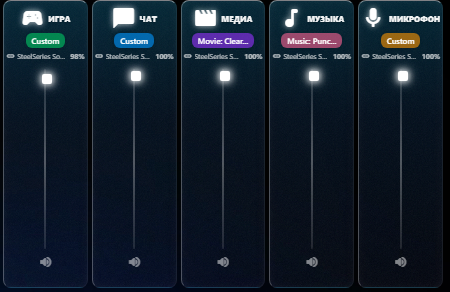

# Sonar Glass Widget

Интерактивный виджет рабочего стола для управления аудиоканалами SteelSeries Sonar.



## Возможности

- Управление громкостью каналов Game, Chat, Media, Music и Mic в реальном времени
- Выбор реальных устройств вывода для каждого канала и устройства ввода для микрофона
- Прозрачный интерфейс в стиле glassmorphism
- Автоматическая синхронизация со SteelSeries GG
- Настоящий слой рабочего стола: обычные окна естественно перекрывают виджет
- Отсутствие виджета в панели задач и Alt+Tab
- Ярлыки рабочего стола являются препятствиями при перетаскивании
- Автоматическое восстановление после перезапуска Explorer
- Сохранение позиции между запусками и автозапуск с Windows

## Требования

- Windows 10/11
- SteelSeries GG с включённым Sonar
- Node.js 16+ для разработки

## Установка

### Готовая сборка
1. Скачайте последний выпуск из раздела [Releases](../../releases).
2. Запустите установщик или portable-версию.
3. Виджет автоматически добавится в автозапуск Windows.

### Из исходного кода
```bash
# Клонировать репозиторий
git clone https://github.com/feechkablum6/SteelSeries-Sonar-volume-control-widget.git
cd SteelSeries-Sonar-volume-control-widget

# Установить зависимости
npm install

# Запустить в режиме разработки
npm start

# Собрать исполняемый файл
npm run build
```

## Использование

- Перетаскивайте виджет за верхнюю полосу.
- Слайдеры управляют громкостью каналов.
- Значок динамика включает и выключает звук.
- Нажмите на название устройства под каналом, чтобы выбрать другой выход или вход Sonar.
- Виджет не проходит через ярлыки и не может быть установлен поверх них.
- Обычные окна перекрывают виджет без его скрытия и повторного показа.
- Изменения синхронизируются со SteelSeries GG в реальном времени.

## Проверка

```bash
npm test
npm start
```

## Технологии

- Electron 28
- Неофициальный API SteelSeries Sonar
- Koffi для вызовов Windows API
- Vanilla JavaScript
- CSS Glassmorphism

## Лицензия

MIT

## Благодарности

- Обратное проектирование API SteelSeries Sonar: [steelseries-sonar-py](https://github.com/Mark7888/steelseries-sonar-py)
